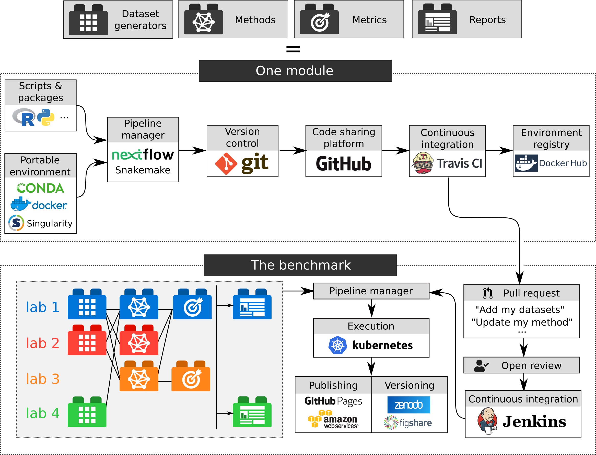

---
author-meta:
- Wouter Saelens *
- Robrecht Cannoodt *
- Lukas Weber
- Charlotte Soneson
- Yvan Saeys *
- Mark D. Robinson *
date-meta: '2018-11-17'
keywords:
- bioinformatics
- methods
- benchmarking
- single-cell analysis
lang: en-US
title: A workflow for continuous and collaborative benchmarking
...

<small><em>
This manuscript
([permalink](https://komparo.github.io/manuscript-workflow/v/df9eb62c9fd584accf982363fdb02f595b53f631/))
was automatically generated
from [komparo/manuscript-workflow@df9eb62](https://github.com/komparo/manuscript-workflow/tree/df9eb62c9fd584accf982363fdb02f595b53f631)
on November 17, 2018.
</em></small>

## Authors

+ **Wouter Saelens *** 
    {height="13px" width="13px"}
    [0000-0002-7114-6248](https://orcid.org/0000-0002-7114-6248)
    · {height="13px" width="13px"}
    [zouter](https://github.com/zouter)
    · {height="13px" width="13px"}
    [zouters](https://twitter.com/zouters) 
  <small>
     Data Mining and Modelling for Biomedicine, VIB Center for Inflammation Research, Ghent, Belgium; Department of Applied Mathematics, Computer Science and Statistics, Ghent University, Ghent, Belgium
     · Funded by Fonds Wetenschappelijk Onderzoek
  </small>

+ **Robrecht Cannoodt *** 
    · {height="13px" width="13px"}
    [rcannood](https://github.com/rcannood)
    · {height="13px" width="13px"}
    [rcannood](https://twitter.com/rcannood) 
  <small>
     Data Mining and Modelling for Biomedicine, VIB Center for Inflammation Research, Ghent, Belgium; Department of Applied Mathematics, Computer Science and Statistics, Ghent University, Ghent, Belgium
     · Funded by Fonds Wetenschappelijk Onderzoek
  </small>

+ **Lukas Weber** 
    · {height="13px" width="13px"}
    [lmwebr](https://twitter.com/lmwebr) 
  <small>
     Institute of Molecular Life Sciences, University of Zurich, Zurich, Switzerland; SIB Swiss Institute of Bioinformatics, University of Zurich, Zurich, Switzerland
  </small>

+ **Charlotte Soneson** 
    · {height="13px" width="13px"}
    [CSoneson](https://twitter.com/CSoneson) 
  <small>
     Institute of Molecular Life Sciences, University of Zurich, Zurich, Switzerland; SIB Swiss Institute of Bioinformatics, University of Zurich, Zurich, Switzerland; Friedrich Miescher Institute for Biomedical Research, Basel, Switzerland
  </small>

+ **Yvan Saeys ***  
  <small>
     Data Mining and Modelling for Biomedicine, VIB Center for Inflammation Research, Ghent, Belgium; Department of Applied Mathematics, Computer Science and Statistics, Ghent University, Ghent, Belgium
  </small>

+ **Mark D. Robinson ***  
  <small>
     Institute of Molecular Life Sciences, University of Zurich, Zurich, Switzerland; SIB Swiss Institute of Bioinformatics, University of Zurich, Zurich, Switzerland
  </small>

## Abstract {.page_break_before}

Benchmarking is a critical step in the development of bioinformatics tools, but the way benchmarking is done at the moment has some limitations. Because each benchmark is developed in isolation, they tend to be hard to compare, extend and are rapidly outdated. Moreover, benchmarks are usually rapidily outdated as new methods are developed. To address these challenges, we combined modern software development tools to create a workflow for continuous and collaborative benchmarking. The structure of the benchmark is highly modular, so that anyone can contribute a set of datasets, metrics, methods or interprete the results, and get credit for their contributions. We apply this worklow on an emerging type of analysis in the single-cell field: trajectory differential expression, available at [https://github.com/komparo/tde](https://github.com/komparo/tde). A skeleton version of the workflow, which can be used to create a similar benchmarking workflow for a different type of methods, can be found at [https://github.com/komparo/skeleton](https://github.com/komparo/skeleton).

## Introduction

<!-- Benchmarking ---------------------------------------------------------------------------------------------------->

Evaluating the performance of a new method, and comparing it to the state-of-the-art, is a critical step in the development of bioinformatics methods. Benchmarks are essential to showcase the advantages and weaknesses of a method, and assure that new tools improve upon related methods. Despite this, well-designed and balanced benchmarking strategy can be difficult to create, especially when a ground truth on real data is not available.

The breadth of a benchmark is influenced by its purpose. In some studies, the goal is to review the methods available in the field, and highlight current challenges. Such independent benchmarks are usually very comprehensive, involving many datasets and different metrics ranging assessing the accuracy, scalability and robustness of a method. A special case of such a benchmark are competitions, where the focus lies on promoting the development of new methods within the field, while using existing methods as baseline. Other benchmarks are used as a companion to a study proposing a new method, demonstrating its improvements and usefulness.

<!-- Problem setting ---------------------------------------------------------------------------------------------------->

While benchmarks are unmistakingly important, the way benchmarking is usually done has some limitations:

* Benchmarks are quickly outdated when new methods come along.
* Benchmarks are difficult to extend, as this is usually only added as an afterthought. <!-- examples: @6VtYRDAK -->
* While benchmarks often reach different conclusions, they are difficult to compare, because of (unclear) differences in datasets, method parameters, metric implementation and aggregation.
* Independent benchmarks and competitions tend to be authoritative, with only a small group of people deciding on how methods should be compared.
* Independent benchmarks are usually published quite late, only after a lot of methods are already available.
* Companion benchmarks represent in some way a lot of wasted effort, because datasets are often reanalysed, metrics reimplemented, and methods rewrapped.

<!--- 
Only the most relevant limitations are discussed here, others:

* Easy to overfit on what is available / ideas of the benchmarker. Examples include the Trapnell trajectory datasets, MINST dataset, but there are several others to be found. At the same time, it is also useful to only have a limited number of "reference" datasets available, to make it easier to develop new methods, so this makes this limitation somewhat controversial. In any case, the datasets should be a good representation of what the method should find "in the wild".
* Companion benchmarks always come down to the same thing.

--->

<!-- Goals  --------------------------------------------------------------------------------------------------------------->

To resolve these issues, we created a workflow for benchmarking which centers around the following three core concepts:

* **Modular**: It should be possible to extend the benchmark simply by adding a self-contained "module". Such a module could be: a dataset generator, a method, a set of metrics, or a report generator that interpretes the metrics and produces a report. Several tools exist already for making benchmarks modular: SummarizedBenchmark [@Yqv1RKnE], [Dynamic Statistical Comparisons](https://github.com/stephens999/dscr) and iCOBRA [@Bqyk8BrN]. <!--- TODO #1 --->
* **Collaborative**: Anyone with a computer and internet connection should be able to run and contribute to the benchmark. This can range from contributing a module, to changing the structure of the benchmark itself. Discussions on the benchmark or any of the reports should also be open. The collaborative aspect of benchmarking has usually focused on the level of methods, with countless competitions and challenges, such as those organised by [DREAM](http://dreamchallenges.org/) or [kaggle](https://www.kaggle.com/).
* **Continuous**: A benchmark should be continously updated when new modules are added. This has quite a long history in bioinformatics, particularly in structure prediction [@bxALj0Vw], but also in other fields [@17EgWn4e7]. <!---- TODO #2 ---->

To construct a workflow which fulfills combines these three concepts, we used several ideas and tools coming from modern software development, such as continuous integration, containerisation and workflow management.

<!-- General overview ------------------------------------------------------------------------------------------------------->

The overall structure uses several different **types of modules**: dataset generators can generate datasets and optionally use another dataset as input, methods use a dataset to generate some model, metrics will calculate some scores using the model and optionally also parts of the dataset, and finally a report generator which summarise the datasets, models and scores into a report. Each type of module can generate a set of files which are constrained to a particular set of **formats**. Each format has an unambiguous description, a set of good and bad examples, and includes a validator which validates the output files generated by each module. While each format is defined beforehand, new formats can be added over time as the field progresses. A **module** is a set of scripts and packages, which are run inside a portable environment. This module is put under version control, shared on a code sharing platform, and tested automatically using continuous integration. When all tests of a module are succesful, these modules can be integrated into the actual **benchmarking workflow**. Within this workflow, modules are connected through a particular design, which is executed using a workflow manager. The output of the benchmark are a set of reports and apps, which are made available through a publishing platforms. To add a new module, a pull request is created to integrate the module within the benchmarking workflow, after which the contribution is reviewed openly. When accepted, the module is automatically integrated within the workflow, and the necessary parts of the workflow are re-executed. Finally, in regular time intervals (e.g. monthly), the full set of reports and apps are gathered and versioned.

<!-- Test case ------------------------------------------------------------------------------------------------------------->

As a test case, we developed a proof-of-concept benchmark for single-cell trajectory differential expression (TDE) methods. TDE methods try to find genes which are differentially expressed along a trajectory, the latter of which is an positioning of cells along a graph structure. Given that only a few of such methods have been developed yet [@13yVWlTc9; @HkU0XKEf; @16zLRyIvX], this is the ideal scenario for developing the idea of a continuous and collaborative benchmark, and try to find solutions to the inevitable challenges which will come up as the field develops.

We will further discuss each element of the workflow in detail, along with how we currently implemented it in practice. It is important to acknowledge here that this is only one possible implementation, and that other tools, some of which still have to be developed, could better fit the benchmarking usecase. In the end, what is the most important are not the way a benchmark is implemented, but the ideas behind its implementation.

{#fig:pipeline width="100%"}

## Data formats

The basis of any collaborative effort in computation biology is agreeing on how data will be interchanged, and benchmarking is no exception. Sometimes, the differences between data formats can be minor, for example whether the samples within a gene expression matrix are put in the rows or in the column. In other cases, different data formats can have a significant impact on storage and/or the speed by which the data can be processed. <!--- TODO #3 --->

### What a format entails

<!-- Description ------------------------------------------------------------------------------------------------------------->

For a format to be useful, it should have an unambiguous description. In this way, someone developing a module can be sure how the inputs look like, even if these inputs do not exist yet, and can also be sure that the outputs will be useful as input for other modules.

<!-- Validation --------------------------------------------------------------------------------------------------------------->

While a description is meant to be readable by humans, this description should also be translated into a lanuage computers can understand, so that each data file produced by a module can be validated. In this way, developers of a module can get immediate feedback on whether their output matches the format description. To make a format validatable, it is one possibility to use one of the many "schemas" available, such as json-schema ([http://json-schema.org/](http://json-schema.org/)), XML schemas or Apache Arrow Schemas. Often, there are already validators available for these schemas (json-schemas for example: [https://json-schema.org/implementations.html#validators](https://json-schema.org/implementations.html#validators)). On the other hand, for more custom file formats or complex behaviour, we will have to implement the validator ourselves.

<!-- Examples ----------------------------------------------------------------------------------------------------------------->
Finally, connecting the human-readable description with the computation validation can be done with providing good and bad examples of the data format. These examples serve a double purpose, because they provide the module contributors several examples as a help to understand the description, but can also be used as test cases for the format validators.

### Formats change as the field progresses

Usually, the most optimal representation of a dataset or the output of a method only becomes apparent when several methods have been developed already. This means that any effort to make a benchmark collaborative and continuous should strive to make its data formats flexible. Flexibility can take several forms. New features could be added to the format, without invalidating the old data and modules. When this is not an option, new formats could be added alongside the old. When applicable, converters should then be written which convert the old formats into the new, so that old modules keep on functioning. Finally, in some extreme cases, old formats could be invalidated and replaced with new formats, which would require some versioning system to make sure modules are run on the version of the formats they were developed.

It is inevitable that disagreements about data representation will pop up in a collaborative effort. But in any case, having common formats, even if they are suboptimal for certain use cases, is usually better then having none at all.

### Test case

For the TDE use case, to keep the formats simple and accesible, we decided to mainly use text-based formats such as comma-separated values (CSV) and JSON files, as these can be rapidly parsed in almost any programming language. For each format, we wrote custom validators in R, although JSON files were also partly validated using a json schema validator (ajv, [https://ajv.js.org/](https://ajv.js.org/)). These validators are available as an R package ([https://github.com/komparo/tde_formats](https://github.com/komparo/tde_formats)). For each format, we wrote a description and several examples, which are shown together in the contributor's guide ([https://komparo.github.io/tde/formats.html](https://komparo.github.io/tde/formats.html)).

## Module types

## Modules

Our pipeline consists of several "modules", which are integrated and connected to ultimately produce a full crowd-sourced benchmarking pipeline. These modules contain the code to generate some datasets, run a method and compare the output. Moreover, to assure a balanced interpretation of the results, report modules will aggregate and summarise the results, and provide some interpretation.

While the idea of creating a more modular benchmarking workflow is not new (SummarizedBenchmark [@Yqv1RKnE] and Dynamic Statistical Comparisons, https://github.com/stephenslab/dsc)

A module also contains several other components which are in our view necessary to make the workflow easily extendable.

### Scripts and packages

A very varied set of programming languages used in bioinformatics, even within particular a particular subfield (such as single-cell bioinformatics [@ekkzy8ZR]). A collaborative workflow should therefore avoid a "lock-in" to a particular language.

### Portable environment

### Pipeline manager

- Provides an interface between different modules
- Controls reproducible execution of the scripts within the environment
- Input and output should always be explicitely defined
- Rerunning the module, or parts of the module, should only be triggered if input has changed
- Checks whether the inputs are present
- Checks whether the outputs are created and validates this output

### Version control

- Crucial for keeping track of what was changed when
- Also crucial for collaborating

### Code sharing platform

Code sharing is more than a place to deposit code:
- Create issues
- Create pull requests
- Versioning the code

### Automated testing and continuous integration

Testing a module:
- Checks the modules content, e.g. if the metadata is complete
- Checks whether it fullfills the requirement for this module, e.g. if it wil generate the required outputs
- Tests whether it can be loaded
- Tests whether it can be run using small input data
- Validates the produced output

While continuous integration for every module can sound like overdoing it, 90% of the errors are caught here. For small benchmarks, it is overkill, for large benchmarks, it is indispensible for maintainability

### Environment registry

- Easily downloadable by anyone wanting to replicate the environment

## Combining modules within a benchmark

### Combining modules

### Pipeline manager

### Execution

### Continuous publishing

### Adding or updating a module

### Continuous integration

### Versioning

## Outlook

The project as it stands now is meant to be a proof-of-concept. Technologies, and the companies and communities building them, come and go, and the tools we used for this benchmark will almost certainly feel outdated in a couple of years. The crucial point is not which tools are used, but what advantages they provide for the community: a portable environment, a reproducible workflow, a way to collaboratively design a benchmark, and ultimately a more democratic view of the field and its challenges lying ahead.

In the ideal case, a continuous benchmarking project should be supported by a larger consortium, such as the Human Cell Atlas, which would not only assure its continuity, but would also provide infrastructure support. In particular, services which have strong requirements on the side of storage and/or computing power would benefit from this, such as continuous integration, the environment registry, and the execution cluster.

By providing a shared platform where old and current ideas are rigorously tested, and new ideas can be easily validated, 

A platform like this should be build upon the idea that future methods and output formats can never be predicted, but at least we can prepare for them.

### Reports as a forum

- Discuss multiple possible interpretations
- Self-assessment trap [@9jjMfS7z]

## References {.page_break_before}

<!-- Explicitly insert bibliography here -->

